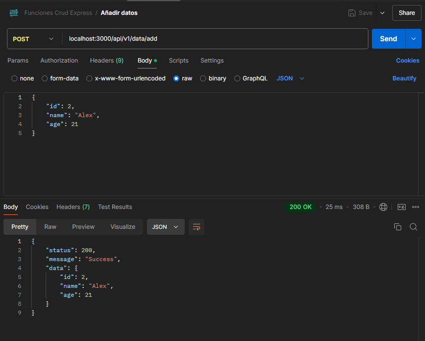
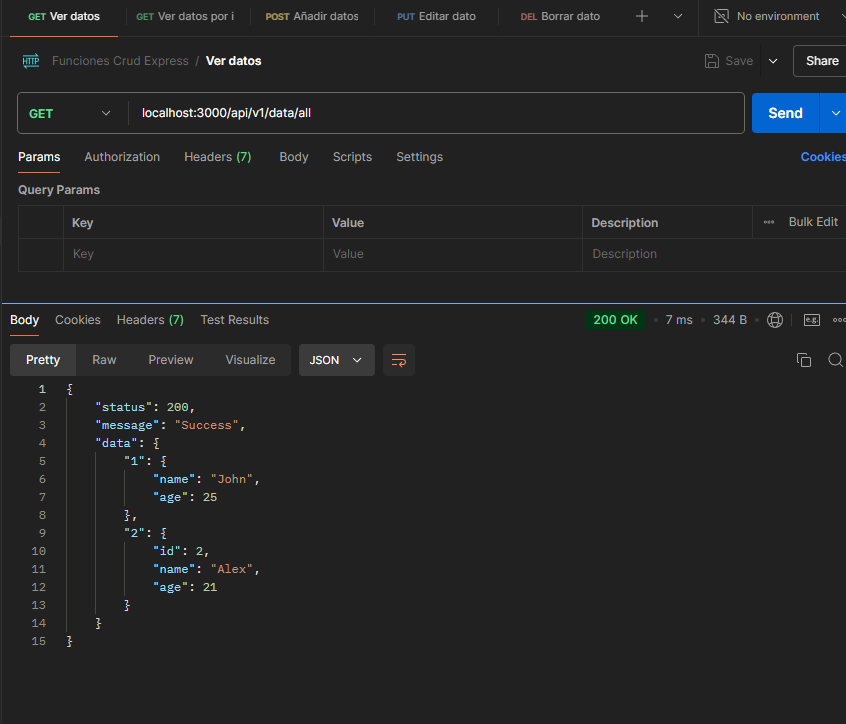
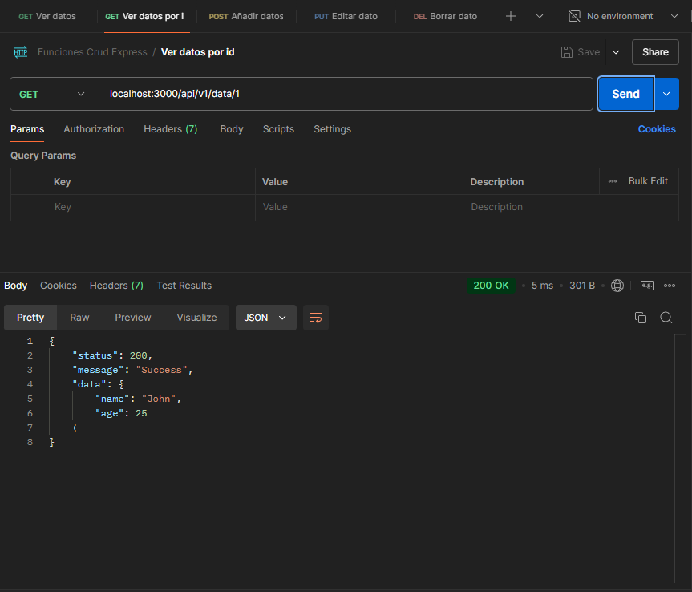
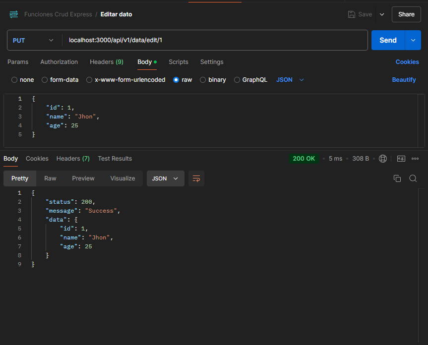
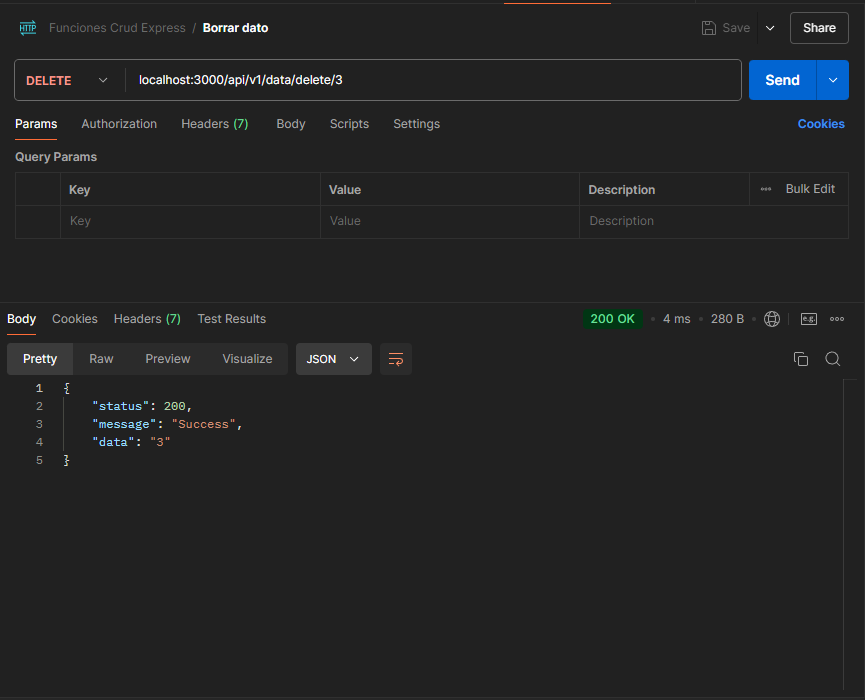

# EJERCICIO | APIREST EXPRESS NODEJS

## Descripción

APIREST con Express y NodeJS que permite realizar operaciones CRUD sobre una colección de usuarios.

## Requisitos

- NodeJS
- NPM
- Postman

## Detalles:

En comparación con otros frameworks, Express es un framework minimalista que permite crear aplicaciones web de
manera sencilla y rápida. En este ejercicio se ha creado una APIREST con Express y NodeJS que permite realizar
operaciones CRUD sobre una colección de usuarios. Para ello, se han creado las siguientes rutas:

- **GET /api/v1/data/all**: Devuelve un listado de todos los usuarios.
- **GET /api/v1/data/:id**: Devuelve un usuario en concreto.
- **POST /api/v1/data/add**: Añade un nuevo usuario.
- **PUT /api/v1/data/edit/:id**: Actualiza un usuario en concreto.
- **DELETE /api/v1/data/delete/:id**: Elimina un usuario en concreto.

Con respecto a otros frameworks como lo son Django o Ruby on Rails, Express es mucho más ligero y flexible, lo que
permite una mayor personalización y control sobre la aplicación. Además, Express es muy fácil de aprender y de
utilizar, lo que lo convierte en una excelente opción para desarrollar aplicaciones web de manera rápida y sencilla.

## Instalación
- Clonar el repositorio
- Ejecutar `npm install` para instalar las dependencias
- Ejecutar `npm start` para iniciar el servidor
- Utilizar Postman para realizar las peticiones a la API
- Disfrutar de la APIREST con Express y NodeJS

## Imagenes:

## Autor
- Jonathan Narvaez